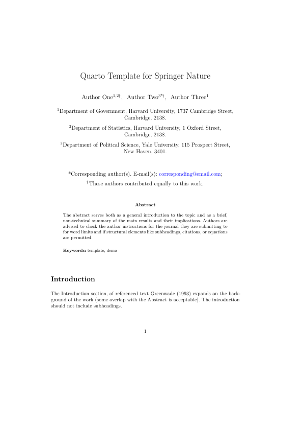

# Springer Nature Quarto Format

## Creating a New Article

To create a new article using this format:

```bash
quarto use template christopherkenny/nature
```

This will create a new directory with an example document that uses this format.

## Using with an Existing Document

To add this format to an existing document:

```bash
quarto add christopherkenny/nature
```

Then, add the format to your document options:

```yaml
format:
  nature-pdf: default
```

## Options

- `natbibstyle`: the name of the natbib style for the Nature subjournal
  - `default`: Default
  - `sn-nature`: Style for submissions to Nature Portfolio journals
  - `sn-basic`: Basic Springer Nature Reference Style/Chemistry Reference Style
  - `sn-mathphys-ay`: Math and Physical Sciences Reference Style (author-year)
  - `sn-mathphys-num`: Math and Physical Sciences Reference Style (numbered)
  - `sn-aps`: American Physical Society (APS) Reference Style
  - `sn-vancouver`: Vancouver Reference Style
  - `sn-apa`: APA Reference Style 
  - `sn-chicago`: Chicago-based Humanities Reference Style
- `classoption`:
  - `iicol`: double column layout, usually used with `natbibstyle: default`
  - `Numbered`: Numbered reference style, usually used with `natbibstyle: sn-vancouver`.
  - `referee`: double spaced for first submissions
  - `lineno`: print line numbers in the margin

Since `cite-method: citeproc` is the
[default](https://quarto.org/docs/authoring/footnotes-and-citations.html#sec-biblatex),
to respect the natbib reference styles, you would need to set `cite-method: natbib`,
such as:

```yaml
format:
  nature-pdf:
    natbibstyle: sn-mathphys-num
    cite-method: natbib
```

and restrict usage to [pandoc standard](https://pandoc.org/MANUAL.html#citation-syntax)
references: `[@key01; @key02]`. This has the advantage that it will respect the styles
officially included in the [Springer Nature template][springer-template].
However it has the disadvantage that the citations will not be consistent with
html and docx outputs. To achieve this, set

```yaml
csl: ./path/to/springer-basic-author-date.csl
```

to a path to a CSL file. Several are vendered in
[_extensions/nature/csl/](./_extensions/nature/csl/).
Additional CSL style files can be found in the
[citation-style-language/styles](https://github.com/citation-style-language/styles)
repository, the [recommended](https://citationstyles.org/authors/)
[Zotero Style Repository](https://www.zotero.org/styles) for downloading these
styles, and elsewhere[^1]. The `csl` parameter can be specified independent of the
specification of `cite-method: citeproc` or `cite-method: natbib` but the former
will lead to consistency of the pdf output with html and docx while the latter
will use the csl file with citeproc for non-LaTeX outputs and natbib for the
LaTeX-rendered pdf.

[^1]: The vendored Citation Style Language (CSL) files are copyrighted by the [Citation Style Language project](https://citationstyles.org/). These files have not been modified and are redistributed as licensed under the Creative Commons Attribution-ShareAlike 3.0 Unported License ([CC BY-SA 3.0](https://creativecommons.org/licenses/by-sa/3.0/)).

## Example

Here is the source code for a minimal sample document: [template.qmd](template.qmd).

<!-- pdftools::pdf_convert('template.pdf',pages = 1) -->
<div style="width: 100%; text-align: left;">
  <a href="template.pdf">
    
  </a>
</div>

## License

This modifies the [Springer Nature journal article template package][springer-template].
The original template is licensed under the [LaTeX Project Public License 1.3c](https://www.latex-project.org/lppl/lppl-1-3c/). The template within is derived from this and makes modifications to separate into the full document into Quarto "partials". All modifications can be seen in this repo.

[springer-template]: https://www.springernature.com/gp/authors/campaigns/latex-author-support/see-where-our-services-will-take-you/18782940
